<picture>
  <source media="(prefers-color-scheme: dark)" srcset="assets/banner-dark.svg">
  <source media="(prefers-color-scheme: light)" srcset="assets/banner-light.svg">
  
</picture>

  
  
  
  
  

## 👋 Hey, I'm Christian

- 🔴⚫ Big Data Analytics student at **SDSU**
- 🌀 Research Assistant at the **SCIL Lab**, working on AI weather forecasting and full-stack development
- 🤖 Into machine learning, data science, and making data look good

## 🔭 What I'm exploring

- 🌪️ Machine learning for weather and climate forecasting
- 📊 Data visualization
- 🧠 New ML/AI experiments

## 🧰 Tools I use

  <b>🤖 ML</b> &nbsp; 
  <b>🌀 Weather</b> &nbsp; 
  <b>📚 Data</b> &nbsp;   
  <b>📊 Viz</b> &nbsp;  
  <b>🖥️ Apps</b> &nbsp;

## 💬 Say hi

<picture>
  <source media="(prefers-color-scheme: dark)" srcset="assets/waves-dark.svg">
  <source media="(prefers-color-scheme: light)" srcset="assets/waves-light.svg">
  
</picture>
